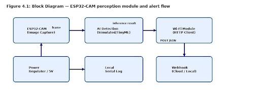
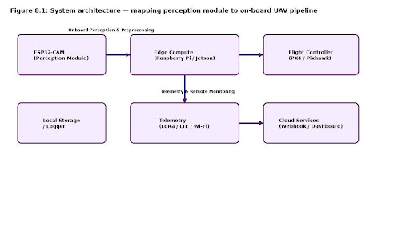

# AI-Powered UAV for Precision Crop Monitoring and Yield Optimization

This project demonstrates a **low-cost AI-enabled UAV perception prototype** using an **ESP32-CAM** module.  
The system simulates a UAV perception pipeline capable of detecting anomalies and sending alerts to a monitoring server.

The prototype models how **AI-powered UAV systems can monitor agricultural environments and provide real-time alerts**.

---

## Project Overview

Modern UAV systems rely on artificial intelligence to convert sensor data into useful insights.  
This project implements a **prototype perception node** that captures images, performs simulated anomaly detection, and sends alerts via Wi-Fi to a webhook server.

The system demonstrates the **Sense → Analyze → Alert** pipeline used in UAV perception systems.

---

## System Architecture

### Block Diagram

### UAV System Architecture

---

## Hardware Components

- ESP32-CAM (OV2640 camera module)
- FTDI USB-to-TTL adapter
- Regulated 5V power supply
- Laptop or local server for webhook receiver

---

## Software Stack

- Arduino IDE (ESP32 firmware development)
- Python Flask server for webhook receiver
- Wi-Fi communication using HTTP POST
- JSON alert messaging

---

## System Workflow

1. ESP32-CAM captures image frames  
2. Detection logic analyzes sensor input  
3. An anomaly trigger generates an alert  
4. JSON payload is sent to a webhook server via Wi-Fi  
5. Flask server receives and logs the alert  

---

## Repository Structure
ai-uav-crop-monitoring
│
├── firmware
│   └── esp32_cam_alert_system.ino
├── server
│   └── webhook_receiver.py
├── diagrams
│   ├── block_diagram.png
│   └── system_architecture.png
├── report
│   └── AI-Powered_UAV_for_Precision_Crop_Monitoring.pdf
└── README.md

---

## Key Features

- Low-cost UAV perception prototype  
- ESP32-CAM based sensing system  
- Real-time alert communication using Wi-Fi  
- Flask webhook receiver for event logging  
- Modular design for TinyML integration  

---

## Future Improvements

- Integrate **TinyML models for real object detection**
- Add **SLAM / VIO modules for UAV localization**
- Replace Wi-Fi with **LoRa or LTE telemetry**
- Integrate with **PX4 flight controller**

---

## Author

**Shaik Naved Ahmed**  
B.Tech – Computer Science & Artificial Intelligence  
SR University, Warangal  

---

## References

- YOLOv3: An Incremental Improvement – Joseph Redmon  
- ESP32-CAM Technical Documentation  
- PX4 Autopilot Documentation  
- LSD-SLAM Research Paper  
